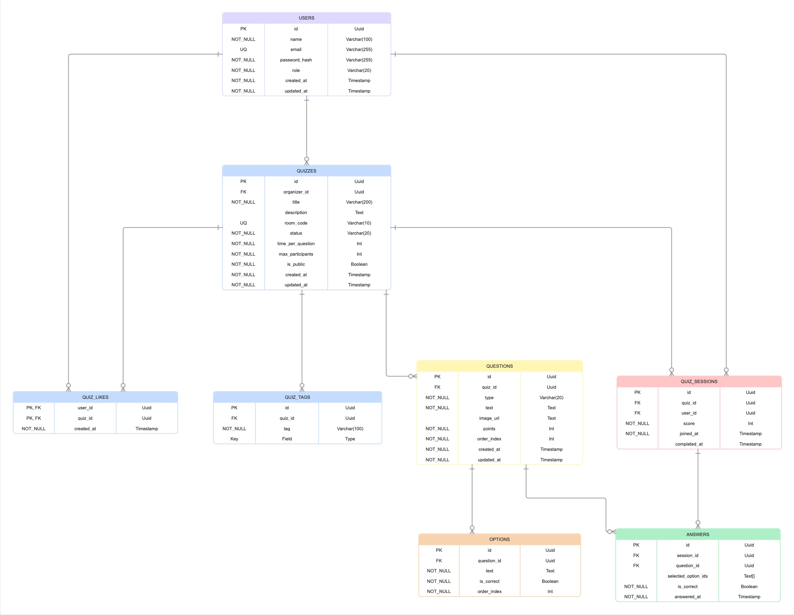

# VK-Quiz - платформа для квизов

VK-Quiz — веб-платформа для проведения онлайн-квизов в режиме реального времени с системой комнат, рейтингов и управлением участниками.

## Запуск проекта

1. Клонировать репозиторий

```bash
git clone <link>
```

2. Запустить проект

```bash
docker compose up --build -d
```

---
# Прототип базы данных



---

# Дизайн-макеты платформы

## Главная страница


---

## Страница авторизации


### Ошибки авторизации


---

## Страница регистрации


### Ошибки регистрации


---

## Создание квиза

### Основная информация


### Добавление вопросов


### Создание вопроса


---

## Каталог квизов


---

## Прохождение квиза (игрок)

### Ожидание и список игроков


### Процесс ответа


---

## Прохождение квиза (автор)

### Панель ведущего


### Просмотр ответов участников


---

## Результаты

### Страница результатов для автора

